AREA 🚀
===
<p align="center">
  
</p>

<p align="center"> The goal of this project is to discover, as a whole, the software platform that you have chosen through the
creation of a business application.
To do this, we must implement a software suite that functions similar to that of IFTTT and/or Zapier

</p>

# Install & Dependence 🚩
- python3
  ```
  sudo apt install python3.8
  ```
- Nodejs
  ```
  sudo apt-get install -y nodejs
  npm install -g npm@latest
  ```
- Expo
  ```
  npm install expo-cli --global
  ```	
# Services 👨‍💻
 - [GitHub](https://github.com/)
 - [Gmail](https://www.google.com/intl/fr/gmail/about/)
 - [Outlook](https://outlook.live.com)
 - [Youtube](https://www.youtube.com)
 - [Discord](https://discord.com/)
 - [Reddit](https://www.reddit.com/)
 - [Onedrive](https://onedrive.live.com/about)
 - [Timer](https://www.timetimer.com/)
 - [Spotify](https://open.spotify.com/)

# App Communication <a name="comm"></a>🎈
<p align="center">
  
</p>

## <u>Mobile Client</u>
The mobile client should be available on Android or Windows Mobile. It will only be responsible for displaying screens and forwarding requests from the user to the application server.
## <u>Web client</u>
The web client will only be responsible for displaying screens and forwarding requests from the user to the
application server.
## <u>Application Server</u>
The application server is the only one to embed the business logic of the project. It will offer its services to
web & module clients through a REST API.
<p align="center">
  
</p>

# Run ⭐
  ## With Docker
  ```
  sudo docker-compose build
  sudo docker-compose up
  ```
  ## Without Docker
  - Application Server
  ```
  cd area_backend
  flask run
  ```
  - Web Client
  ```
  cd client_web/area
  npm install
  npm start
  ```
  - Mobile Client
  ```
  cd client_mobile/area_mobile
  npm install
  npm start
  ```
# Documentation 📰

- [The technical documentation is avalaible here](https://architect005.github.io/)

```mermaid
pie
title Contributors Commits
"Loïc TOSSOU" : 20
"Prunella DOUSSO" : 35
"Théophile QUENUM" : 8
"Zihada Taîrou" : 4
"Cliff Ogoudedji": 27
```

# Contributors <a name = "authors"></a>✍️



